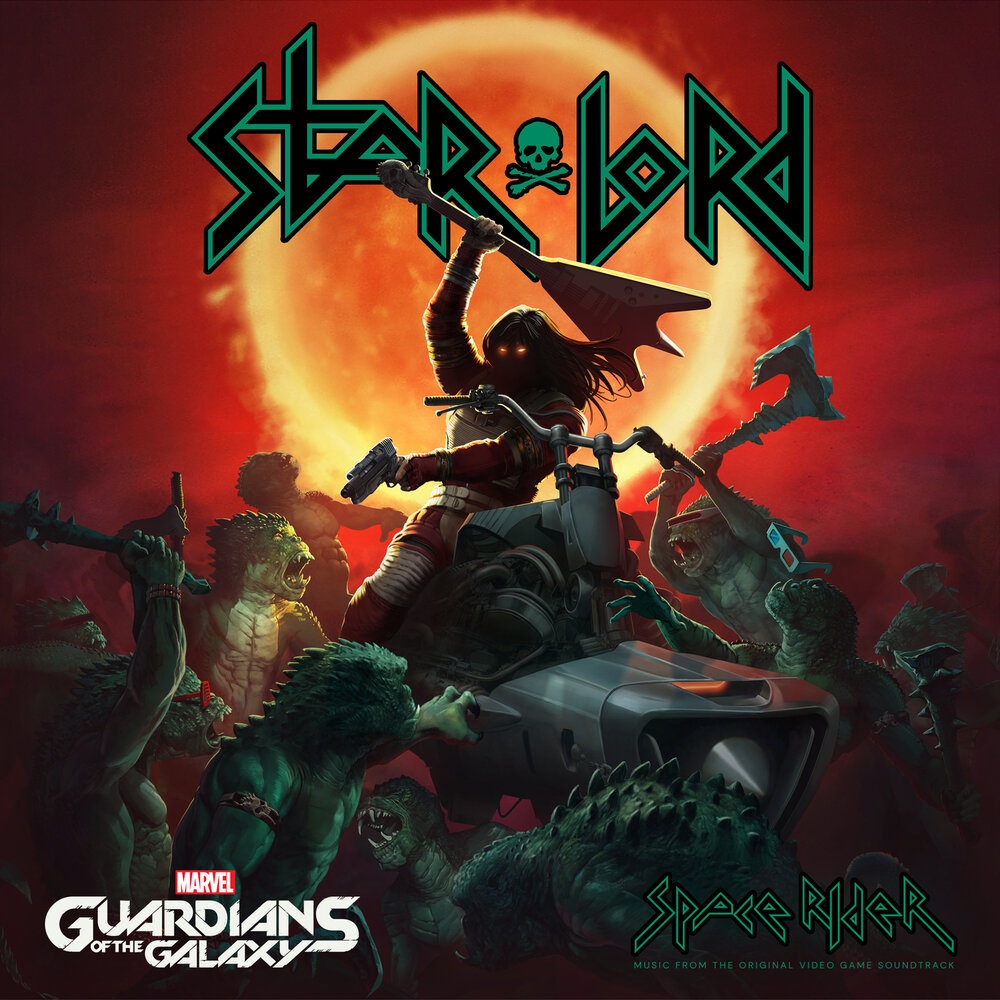

# Инструкция по Markdown

## Выделение текста

Чтобы выделить текст курсивом необходимо обрамить его звездочками (*) или заком нижнее подчеркивание(_). Например, *вот так* или _вот так_

Чтоы выделить текст полужирным, необходимо обрамить его двойными звездочками(**) или двайным знаком нижнего подчеркивания(__). Например **вот так** или __воттак__

альтернативные способы выделения тектса жирным или полужирным нужны для того чтобы мы могли совмещать оба этих способа. Например _текст может быть выделен курсивом и приэтом быть **полужирным**_

### Списки

Чтобы добавить не нумерованные списки, необходимо пункты выделить звездочкой(*) или знаком (+). Например, вот так:
* пункт1
* пункт2
+ пункт3

Чтобы добавить нумерованные списки, пункты просто пронумровать. Например, вот так:

1. пункт1
2. пункт2
3. пункт3

## Работа с изображением

Чтобы вставить изображение в тескст необходимо вставить следующее:
 

## ссылки

## Раблота с таблицами

## цитаты

## заключение